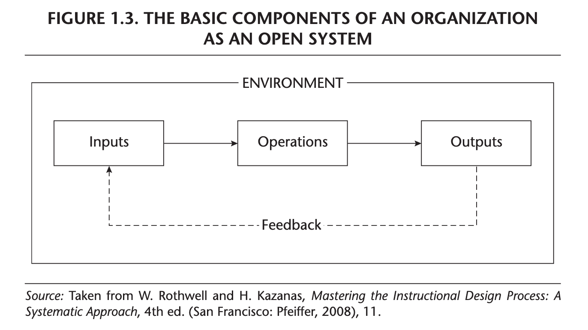
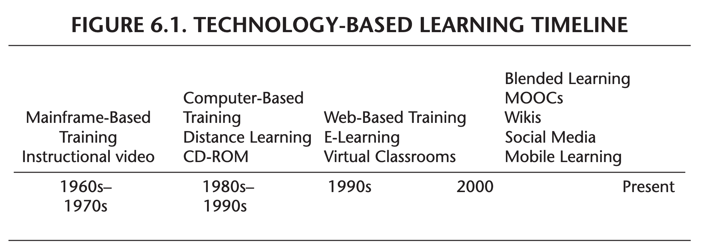
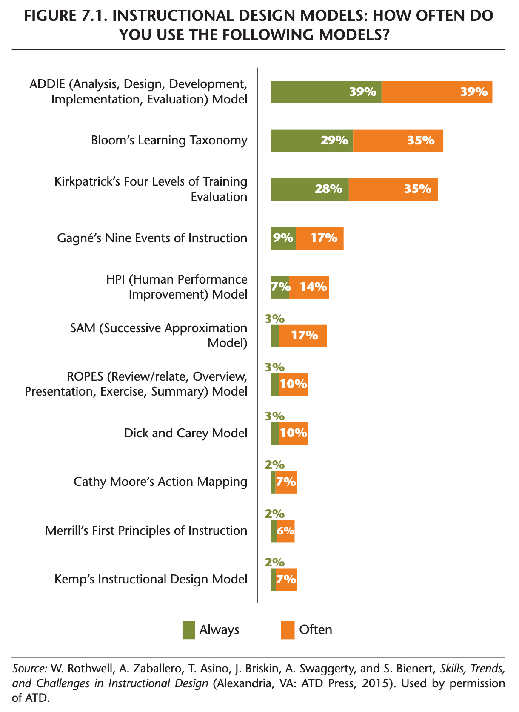
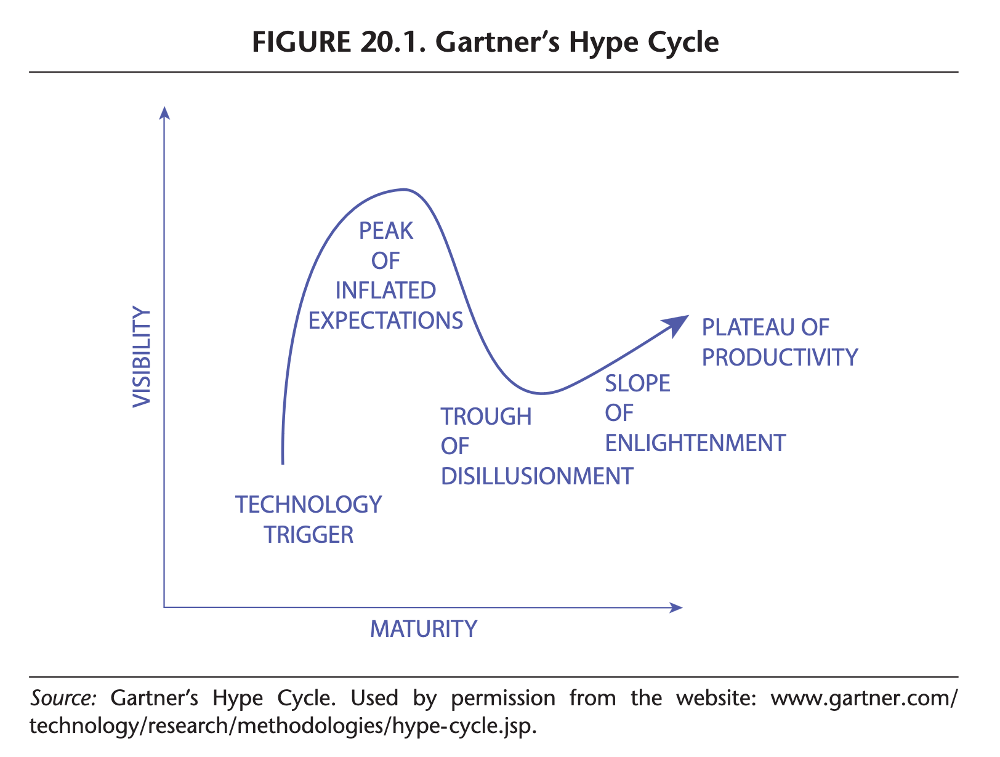
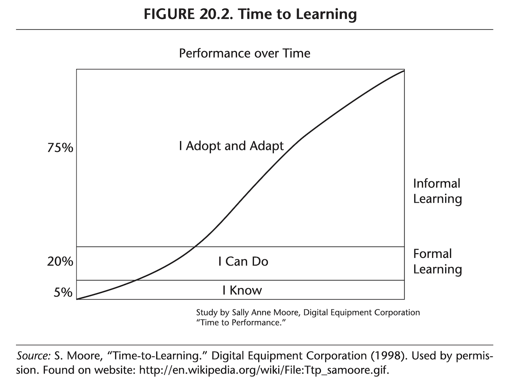

```{r setup, include=FALSE}
usethis::use_git_ignore(c("*.csv", "*.rds"))
options(htmltools.dir.version = FALSE)

library(knitr)
library(tidyverse)
library(xaringan)
library(fontawesome)
```

class: inverse, center, middle

# `r fa("fas fa-images", fill = "#fff")`

**View the slides:** 

[bretsw.com/eme5601-fs24-module3](https://bretsw.com/eme5601-fs24-module3)

---

class: inverse, center, middle

# `r fa("fas fa-network-wired", fill = "#fff")` <br><br> Module 2 Review <br> Systems Analysis

---

class: inverse, center, middle

# `r fa("fas fa-network-wired", fill = "#fff")` <br><br> What was it like writing the Systems Analysis paper?

---

# `r fa("fas fa-network-wired", fill = "#fff")` Systems Analysis paper

### What is a **system**?

```{r, out.width = "720px", echo = FALSE, fig.align = "center"}

```

--

<hr>

### `r fa("far fa-comments", fill = "#782F40")` In groups, work on a definition.

---

# `r fa("fas fa-network-wired", fill = "#fff")` Systems Analysis paper

### **mechanical** system `r fa("fas fa-arrow-right", fill = "#782F40")` **organic** system

```{r, out.width = "640px", echo = FALSE, fig.align = "center"}

```

<div class="caption">
Figure 1.3 from Rothwell et al. (2016, p. 12)
<br><br>
</div>

--

<hr>

### `r fa("far fa-comments", fill = "#782F40")` In groups, work on updating the model.

---

class: inverse, center, middle

# `r fa("fas fa-gauge-high", fill = "#fff")` <br><br> Module 3 <br> Performance Analysis

---

class: inverse, center, middle

# `r fa("fas fa-gauge-high", fill = "#fff")` <br><br> Analyzing Potential Use of Existing and Emerging Technologies <br> (Ch. 6)

---

# `r fa("fas fa-gauge-high", fill = "#fff")` E-Learning Technologies

```{r, out.width = "480px", echo = FALSE, fig.align = "center"}
include_graphics("img/toolbench.jpg")
```

- Computer-based training
- Web-based training
- Blended learning
- Web 1.0 Static Content
- Web 2.0 Mobile and Social Learning
- Social Media
- Gamification
- Web 3.0

---

# `r fa("fas fa-gauge-high", fill = "#fff")` Emerging Technologies

```{r, out.width = "100%", echo = FALSE, fig.align = "center"}

```

<div class="caption">
Figure 6.1 from Rothwell et al. (2016, p. 99)
<br><br>
</div>

--

<hr>

### `r fa("far fa-comments", fill = "#782F40")` What do you think? What's missing?

---

# `r fa("fas fa-gauge-high", fill = "#fff")` Emerging Technologies

```{r, out.width = "600px", echo = FALSE, fig.align = "center"}

```

**"The challenge we face today and into the future is how to integrate all solutions to produce the desired results."**

<div class="caption">
From Rothwell et al. (2016, p. 108)
<br><br>
</div>

--

<hr>

### `r fa("far fa-comments", fill = "#782F40")` What do you think?

---

# `r fa("fas fa-gauge-high", fill = "#fff")` Emerging Technologies

**Web 3.0 has three main components:**

--

- *The semantic web*, in which software can understand the meaning of data and translate that understanding into natural language, creating a customized experience that meets the user’s needs where he or she is.

--

- *The mobile web*, whereby the user can experience the web seamlessly, from one device to another, in any location anywhere in the world.

--

- *The immersive Internet*, comprising virtual worlds, augmented reality, and 3-D environments.

--

<div class="caption">
From Rothwell et al. (2016, p. 112)
<br><br>
</div>

--

<hr>

### `r fa("far fa-comments", fill = "#782F40")` What do you think?

---

# `r fa("fas fa-gauge-high", fill = "#fff")` Emerging Technologies

**Implications for instructional designers:**

--

Whether designing instruction in the print-based or the e-learning worlds, the designer must have a solid foundation in the following four skills:

--

- *Instructional design models*

--

- *Learning theories*

--

- *Evaluation and assessment*

--

- *Project management and consulting*

--

<div class="caption">
From Rothwell et al. (2016, p. 113)
<br><br>
</div>

--

<hr>

### `r fa("far fa-comments", fill = "#782F40")` What do you think?

---


class: inverse, center, middle

# `r fa("fas fa-gauge-high", fill = "#fff")` <br><br> Using an Instructional Design Process Appropriate for a Project  <br> (Ch. 7)

---

# `r fa("fas fa-gauge-high", fill = "#fff")` ISD Models

```{r, out.width = "320px", echo = FALSE, fig.align = "center"}

```

<div class="caption">
Figure 7.1 from Rothwell et al. (2016, p. 121)
<br><br>
</div>

--

<hr>

### `r fa("far fa-comments", fill = "#782F40")` In groups, talk through your familiarity with these models.

---

# `r fa("fas fa-gauge-high", fill = "#fff")` ISD Models

```{r, out.width = "480px", echo = FALSE, fig.align = "center"}

```

**Key tasks for instructional designers:**

--

- Select or create an instructional design process based on the project.

--

- Modify the instructional design process as project parameters change.

--

- Describe a rationale for the selected, created, or modified instructional design process.

--

<div class="caption">
From Rothwell et al. (2016, pp. 123-124)
<br><br>
</div>

---

# `r fa("fas fa-gauge-high", fill = "#fff")` ISD Models

```{r, out.width = "420px", echo = FALSE, fig.align = "center"}

```

**Find an approach that strikes a four-way balance:**

--

- Robust

--

- Research- and theory-based

--

- Fast

--

- Cost-effective

--

<div class="caption">
From Rothwell et al. (2016, p. 123)
<br><br>
</div>

---


class: inverse, center, middle

# `r fa("fas fa-gauge-high", fill = "#fff")` <br><br> Planning Noninstructional Interventions <br> (Ch. 10)

---

# `r fa("fas fa-gauge-high", fill = "#fff")` Management Solutions

--

**Noninstructional, nonlearning solutions:**

--

- *Feedback*

--

  - incidental or intentional

--

  - coaching

--

  - production wall charts

--

  - memorandums

--

  - team meetings

--

  - performance appraisals (annual, 360-degree review, performance management system, customer surveys)
  
<div class="caption">
From Rothwell et al. (2016, pp. 173-176)
<br><br>
</div>

---

# `r fa("fas fa-gauge-high", fill = "#fff")` Management Solutions

**Noninstructional, nonlearning solutions:**

- *Job Performance Aids*

--

  - checklists

--

  - algorithms / flowcharts

--

  - procedure manuals

--

  - play scripts

--

  - computer-based reference system

--

  - work samples

<div class="caption">
From Rothwell et al. (2016, pp. 176-179)
<br><br>
</div>

---

# `r fa("fas fa-gauge-high", fill = "#fff")` Management Solutions

**Noninstructional, nonlearning solutions:**

- *Reward Systems*

--

  - intentional

--

  - external

--

  - standardized

<div class="caption">
From Rothwell et al. (2016, pp. 179-181)
<br><br>
</div>

---

# `r fa("fas fa-gauge-high", fill = "#fff")` Management Solutions

**Noninstructional, nonlearning solutions:**

- *Employee Selection Practices*

--

  - recruitment (inside, outside)

--

  - job analysis

--

  - job performance aid: employment interview guide
  
<div class="caption">
From Rothwell et al. (2016, pp. 181-184)
<br><br>
</div>

---

# `r fa("fas fa-gauge-high", fill = "#fff")` Management Solutions

**Noninstructional, nonlearning solutions:**

- *Organizational Redesign*

--

  - organizational redesign

--

  - job redesign

--

  - work design

<div class="caption">
From Rothwell et al. (2016, pp. 184-187)
<br><br>
</div>

---


class: inverse, center, middle

# `r fa("fas fa-gauge-high", fill = "#fff")` <br><br> Predicting the Future of Instructional Design <br> (Ch. 20)

---

# `r fa("fas fa-gauge-high", fill = "#fff")` Future of ISD

```{r, out.width = "560px", echo = FALSE, fig.align = "center"}

```

<div class="caption">
Figure 20.1 from Rothwell et al. (2016, p. 344)
<br><br>
</div>

--

<hr>

### `r fa("far fa-comments", fill = "#782F40")` In groups, talk about what's hyped right now.

---

# `r fa("fas fa-gauge-high", fill = "#fff")` Future of ISD

**Technological advances to improve delivery and design:**

--

- virtual delivery and scale

--

- simulations and virtual reality

--

- ubiqitous computing, mobile learning, and wearable technology

--

- gamification

--

- networked learning through social and virtual collaboration (peer, expert)

--

- mass customization of learning (personalized learning)

---

# `r fa("fas fa-gauge-high", fill = "#fff")` Future of ISD

**Technological advances to improve delivery and design:**

- outsourcing instructional design

--

- global sourcing of content and design

--

- open-sourced design and development

--

- intellectual property and copyright issues

--

- rapid deployment from need to solution

--

- proliferation of video-based learning

--

- informal learning (self-directed, lifelong, continuous, non-formal, incidental)

--

- future generations of learners

---

# `r fa("fas fa-gauge-high", fill = "#fff")` Future of ISD

```{r, out.width = "640px", echo = FALSE, fig.align = "center"}

```

<div class="caption">
Figure 20.2 from Rothwell et al. (2016, p. 355)
<br><br>
</div>


---

class: inverse, center, middle

# `r fa("fas fa-binoculars", fill = "#fff")` <br><br> Looking ahead

---

# `r fa("fas fa-calendar-day", fill = "#fff")` Semester Schedule

```{r, out.width = "480px", echo = FALSE, fig.align = "center"}
include_graphics("img/across-time.jpg")
```

- **Module 1:** Introduction to Instructional Systems Design

- **Module 2:** Systems Analysis

- **Module 3: Performance Analysis**

- **Module 4:** Needs Assessment

- **Module 5:** Work Analysis

- **Module 6:** Design & Development

- **Module 7:** Evaluation

---

# `r fa("fas fa-list", fill = "#fff")` Module Structure

```{r, out.width = "540px", echo = FALSE, fig.align = "center"}
include_graphics("img/workshop.jpg")
```

- `r fa("fas fa-video", fill = "#782F40")` Optional Office Hours: **Wednesdays 2:30-3:00pm ET**

- `r fa("fas fa-book-open", fill = "#782F40")` Read

- `r fa("far fa-comments", fill = "#782F40")` Meet: **Wednesdays 3:05-5:40pm EST**

- `r fa("fas fa-keyboard", fill = "#782F40")` Create

---

# `r fa("far fa-keyboard", fill = "#fff")` Major Assignments

```{r, out.width = "320px", echo = FALSE, fig.align = "center"}
include_graphics("img/build.jpg")
```

- **Assignments** (70%)

  - Module 2 Assignment: Systems Analysis paper (150 points)

  - **Module 3 Assignment: Annotated Bibliography 1 (50 points)**

  - Module 4 Assignment: Needs Assessment paper (150 points)

  - Module 5 Assignment: Annotated Bibliography 2 (50 points)

  - Module 6 Assignment: Work Analysis paper (150 points)

  - Module 7 Assignment: ISD Process Model paper (150 points)

---

class: inverse, center, middle

# `r fa("fas fa-question", fill = "#fff")` <br><br> Questions

<hr>

**What questions can I answer for you now?**

**How can I support you this week?**

<hr>

`r fa("fas fa-envelope", fill = "#fff")` [bret.staudtwillet@fsu.edu](mailto:bret.staudtwillet@fsu.edu) | `r fa("fas fa-globe", fill = "#fff")` [bretsw.com](https://bretsw.com) | `r fa("fab fa-github", fill = "#fff")` [GitHub](https://github.com/bretsw/)